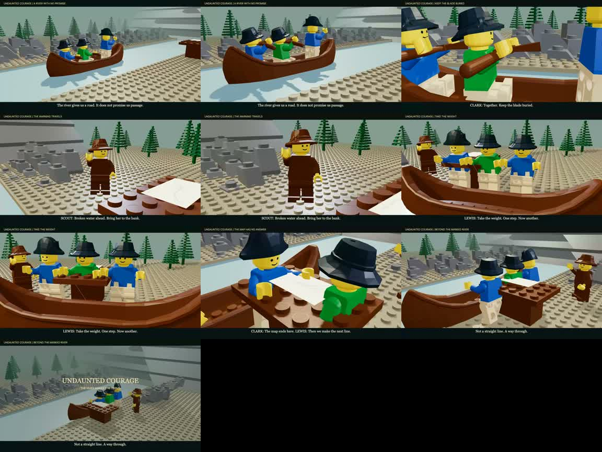

# Undaunted recovery plan — September 17, 2026

## Decision

**The 40-second river proof fails the visual and coverage gate. It is not the replacement film.** Retain it as a regression example. Rebuild from the original inventory, with a reviewed camera plan and physical action before making another full cut.

The original rehearsal contains **17 shots / 105 seconds / seven source scenes**. The supplied reference video is approximately 65.5 seconds. These are different edits; do not treat their timecodes as interchangeable. The six-shot proof contains no horses, commissioning room, fort camp, mountain passage or Pacific coast. Reusing a river theme is not restoring a source shot.

## Repository confirmation

Audited remote main `f85682c29b062632bf08422a8eec3c1650e407a1`. GitHub Pages build: `built`, no reported error. Public Odyssey page: HTTP 200 on September 17.

- [Odyssey playable world](https://hartswf0.github.io/tractor-dce-gyo/odyssey-production/native/word-to-world.html?world=odyssey&ground=real&as=odysseus-sword&place=Voidokilia+Beach+Greece&rehearsal=cave&mute=1).
- Main contains `native/world/horse-motion.js`, `odyssey-play.js`, `drive.js`, `odyssey-mode.js`, and the Odyssey boat, assembly, performance and rehearsal modules under `odyssey-production`.
- The production Word-to-World HTML loads the horse and playable rehearsal scripts. The root Word-to-World HTML does not load these same Odyssey extensions.
- Rehearse → Place horse creates the rideable horse (4493c01) and rigs segmented legs; E mounts/boards, WASD moves. The location assembly tray explicitly places a **static** horse. Do not confuse the two paths.
- This audit confirms publication and wiring, not a fresh end-to-end terrain/riding session. Real-location services can fail independently of the code being published.
- Monkey-Iron currently offers only a static horse prop. It has no riding adapter and no Hand-Iron hand controls. Those are outstanding integrations.

## What the pictures show

Reference contact sheet: supplied MP4 sampled at 0, 6, 12, 18, 24, 30, 36, 42, 48, 54, 60 seconds. These frames establish visual targets, not historical verification or a full audio review.

- Mounted silhouettes against a route landscape; soldiers march past an officer; banquet and civic architecture establish the scale of the commission.
- Hands on a map with a horse behind them; crew working a boat in snowy terrain; firelight and a journal close-up.
- People set against a distant river valley; candlelit writing. The shots vary the human task, distance, setting and lighting.

Current proof sampled every four seconds:

| Visible failure | Required correction |
|---|---|
| Oars cross chests/heads and remain high above the water | Frame the full blade stroke. Hand grip → blade entry → pull → release must be continuous and visible. |
| Haulers appear to shuffle beside a gliding boat | Fix feet during the loaded part of each step; establish taut ropes and a readable hull response. |
| Uniform pale banks, repeated trees and huge slab-like far rocks | Build distinct foreground, playable route and distant landform from a location reference. Review a wide frame before dressing. |
| Smiling generic figures and repeated gestures | Identify each speaking/listening turn; give the listener a reaction before the camera moves on. |
| Blank/overexposed map and awkward table in the route | Stage a legible insert with lower exposure and a clear approach/exit path. |
| Camera movement supplies most of the activity | Give each shot an observable change: mount, hand over, stop, pull, choose, or reveal. |

## Original coverage ledger

Every original shot remains visible in `undaunted-source-coverage.json`, including source MPD, asset IDs, original camera keys, duration, intent, and explicit restoration status. Status means **not restored**, not ready to shoot.

| ID | Original time | Shot | Source scene | In river proof |
|---|---|---|---|---|
| UC-01 | 0–6s | The undertaking | 0 | Absent |
| UC-02 | 6–12s | The room makes a demand | 1 | Absent |
| UC-03 | 12–17s | At the desk | 1 | Absent |
| UC-04 | 17–22s | From room to river | 1 | Absent |
| UC-05 | 22–29s | The river carries the frame | 2 | Theme only; source staging absent |
| UC-06 | 29–35s | A working camp | 2 | Theme only; source staging absent |
| UC-07 | 35–41s | Two banks, one meeting | 2 | Theme only; source staging absent |
| UC-08 | 41–48s | The fork exceeds the map | 3 | Theme only; source staging absent |
| UC-09 | 48–54s | Portage scale | 3 | Theme only; source staging absent |
| UC-10 | 54–59s | A held decision | 3 | Theme only; source staging absent |
| UC-11 | 59–65s | The camp precedes passage | 4 | Horse assembly 4-2; absent |
| UC-12 | 65–73s | Bitterroot scale | 4 | Horse assembly 4-2; absent |
| UC-13 | 73–79s | The path continues | 4 | Horse assembly 4-2; absent |
| UC-14 | 79–87s | The coast refuses closure | 5 | Absent |
| UC-15 | 87–93s | Wet camp, held bodies | 5 | Absent |
| UC-16 | 93–99s | Later memory — set study | 5 | Absent |
| UC-17 | 99–105s | An arrangement remains | 6 | Absent |

Source scene MPDs remain in `../Brickfilm_Studio_Kit/undaunted_scene_*.mpd`. Source scene 4 has horse assembly `4-2` with parts `10509.dat`, `10509p01.dat`, `10509p02.dat`. Node `4-5` is Lewis described as “on trail with horse”; it is a human node, not another horse. Native Odyssey's 4493c01 horse uses a different rig and must be adapted deliberately.

## Next three shot rehearsals — proposed direction, not rendered footage

### A. Horse passage / UC-12 and UC-13

**Change:** the party stops at a constrained mountain route, a guide finds a passage, the mounted party follows.

- 0–2s: low three-quarter wide, horse enters across foreground; hoof contact and rider silhouette both visible.
- 2–4s: medium on the guide raising a hand; rider stops, reins settle. Keep horse and rider in one coordinated state.
- 4–6s: reaction over the rider's shoulder toward the narrow path; eye line motivates the cut.
- 6–8s: lateral follow as the horse walks through; move the camera only after the first committed step.
- Kit: original scene 4 horses, camp and cast; terrain needs a ridge/pass reference and a usable route. Preserve named characters; costume and history need their own grounding.
- Sound: hoof contacts, tack, breath and wind; leave room for the stop. No new speech until the silent action reads.
- Gate: no foot sliding, saddle separation, horse hovering or camera obstruction. Review start/contact/end frames and the entire eight seconds.

### B. Boat landing / UC-05 into UC-09

**Change:** rowing stops because the water becomes impassable; the crew transfers from boat to shore and takes up the haul.

- 0–2s: low side view shows blade enter and push through water; wake follows the hull.
- 2–4s: bow/shore view reveals the obstruction; lead actor looks before calling the stop.
- 4–6s: wider landing view proves hull, shore and exit path; crew steps off, preserving attachment changes.
- 6–8s: hand/rope insert, then loaded first step. The boat starts moving only after tension is taken.
- Kit: original keelboat/canoe donor choices; don't silently substitute a canoe for every boat. Choose hull and crew capacity before staging.
- Gate: both hands/prop relation, blade/water relation, feet/ground relation, rope/hull relation and boarding hand-off must survive scrubbing backward and forward.

### C. Commission / UC-02 through UC-04

**Change:** a document and responsibility pass from Jefferson to Lewis; Lewis leaves the room.

- Wide establishes both people, desk and door.
- Insert on document turning and hand releasing it.
- Medium reaction holds on Lewis receiving it; eye line returns to Jefferson.
- Departure tracks to the door; cut on the exit into the river preparation scene.
- Kit: source scene 1 room, desk/bookcase and named cast. Remove overlapping torso/limb assemblies before rigging.
- Gate: object ownership changes once, fingers/hand remain at the document, faces are readable, door route is clear. Voices follow this blocking.

## Monkey-Iron engineering priorities

1. **One scene document:** import all original scene and shot IDs, preserve source references and show missing assets. Do not flatten actors into anonymous meshes.
2. **One clock:** actor route, limb pose, attachments, camera, light and audio cues evaluate at any time in either direction. A global action preset is insufficient for a speaking turn or mounting event.
3. **Direct staging:** visible selection, move/rotate controls, ground contact, local/world coordinates, undo and portable saved takes. Hand-Iron input should drive these same commands through an adapter.
4. **Horse/boat adapters:** reuse Odyssey driving/gait work with deterministic time, mount points and explicit hand-offs. A static prop selector is not that integration.
5. **Review before export:** compare reference and actual start/middle/end frames, then watch the whole shot with and without sound. Mark revisions against a specific failure. Assemble only after the three representative shots pass.

## Repairs made during this audit

- Fixed mobile intrinsic-width overflow; all header controls stay inside the viewport.
- Staging panel has a reserved area below the picture on narrow screens, with bounded internal scrolling.
- Canvas orbit/dolly operates only in the Lens tab, so Blocking gestures no longer unexpectedly change the camera.
- Added ±15° heading keys using the existing undo path.
- New props are placed near the selected entity rather than a fixed coordinate elsewhere in the set.
- Added a direct Odyssey riding link and this coverage plan to Project.

These are targeted usability repairs. They do not fix the missing full-film importer, hand controls, contact animation or incomplete original coverage. No new cut is claimed in this audit.
