# The sign score, wired

`score.json` gives every scene of the cut a `direction` block derived from its signs (the primary's operation at 0.6, the
secondaries sharing 0.4). This file says what reads each field in the two renderers that cut the film: the game's cinema
(`play/odyssey-game/cinema.js`, desktop and the one-file phone build) and the film take (`film-readymades/odyssey-take.js`,
which the exporter `tools/export-odyssey.js` renders). The trailer (`film-readymades/odyssey-trailer.js`) takes `move` as the
default camera move of a shot; that belongs to the motion library and is not described here.

## How the directions reach the renderers

| renderer | where the block comes from |
|---|---|
| game (desktop `play/odyssey-game.html`) | `play/odyssey-game/directions.js`, `OG.DIR[sceneId] = {d: direction, p: primary sign, s: secondary signs}`, generated from `score.json` by `tools/odyssey-directions.js`. `tools/odyssey-game.js` runs the generator and adds the script before `cinema.js`. |
| game (phone `play/odyssey-mobile.html`) | the same script, inlined by `tools/odyssey-mobile.js`, which also runs the generator first. The one file carries all 102 directions (31 kB). |
| film take | `take.direction` and `take.signs`, attached to each scene's take by `film-readymades/odyssey_take.py` when the locations are built. A location built before that fetches `odyssey/cineosis/score.json` in `prepare()`. `prepare({grammar: true})` ignores the score. |

## What reads each field

| field | game: `cinema.js` | film: `odyssey-take.js` |
|---|---|---|
| `cut_rhythm` | `C.cut` draws each shot's length from the take's `RHYTHM[cut_rhythm]` table (fast 1.2–3 s, mid 2.4–5 s, slow 5–9.5 s), seeded by scene id and segment. The old coverage cut only on segment seams, so a 30 s narration was one shot. | `tempoOf()` returns `cut_rhythm`. The book's FAST/SLOW table is now `bookTempo()`, used only for transitions (see the tempo rule below). |
| `hold_min_s` | Every draw is at least this long. A shorter shot (a short segment, a segment's tail) merges into its neighbour, so the cut skips that seam. | `cutList()` (called from `cutAt()`) floors every shot the same way and merges across clip seams. A merged shot keeps the clip it began on as its subject. |
| `shot_bias` | Each shot's kind (WIDE, MID, CLOSE, OBJ) is a seeded weighted draw, with one redraw if it repeats the last kind. The first shot is the establishing WIDE. A kind weighted 0.2 or more that the draw missed goes to the longest MID. | Each shot's kind is drawn and mapped onto the syncwatch's: WIDE to WIDE, MID to SPK, CLOSE to REACT (or a close SPK where no one is addressed), OBJ to OBJ. The syncwatch's own resolution still applies after that (no addressee gives the speaker, and the key beat holds the speaker). |
| `move` | Every shot's camera move: push (to 0.80 of the distance, 0.88 on a close), pull (0.9 to 1.12), track (a lateral slide with the look point), orbit (±0.22 rad about the target), crane (rising 20% of the distance), or hold. It is played on twos (12 camera steps a second) and replaces the fixed 1.04 to 0.96 drift. If either end of a move is blocked, the shot holds. | `shootAt()`: a hero or object framing pushes, pulls, orbits (yaw), tracks (a smaller yaw) or cranes (height) by the move. A fixed mark moves about its target the same way. With no direction, it keeps the old 8% hero push and 4% mark push. |
| `empty_frame` | The scene opens on an EMPTY shot: the set's own wide, found by search, so that no head, body or minifig part falls in any phone's frame (landscape, and the engine's taller portrait frame) and the most set parts do. The establishing WIDE follows. Any-space-whatever (`As`) among the signs earns the empty frame too: the score sets the flag on 5 scenes, and the As scenes add Ogygia (V-S01, V-S03) and II-S07. | Not read. An empty frame in the take would need the cast hidden, which is staging. |
| `sound_forward` | One grid of cuts on the scene clock instead of per segment. A cut within 0.9 s of a line's start moves to 1.2 s after it, so the sound leads and the picture follows. The bed is not ducked under the voice (`A.duck`). | `cutList()` lays one grid over the scene and moves cuts off the clips' starts, so `shotAt()` no longer cuts on segment seams. `bedGain()` returns the open level, and `soundLog()` gives the exporter no duck spans, so the rendered WAV matches. |
| `insert_object` | OBJ shots aim at the previs cast entry whose name shares the most words with it (a prop or creature, such as `creature.lead-ram` or `prop.olive-tree-marriage-bed`), at the card parts standing there. With no match, they aim at the subject's hands and body. | `insertAt()` falls back to one insert on it where the authored INSERTS has none. It is seeded between 40% and 60% of the scene, is held for the floor, and is framed on the thing if it is cast, else on the hands of the speaker. |
| `subject` | CLOSE shots are on this figure's head: the previs places the character, the nearest baked head is taken, and the camera comes round to its face. Otherwise a head of the card. | Not read. The take's subject is the turn's speaker or addressee, from the performance. |
| `book_tempo`, `tempo_conflict` | the tempo rule | the tempo rule |

Two figures are read off the primary sign itself, because the score's rules ask for them ("a series is framed the same way
every time... the demark is framed in that same set-up with the aberration in it"):

- **Mark (Mk):** after the establishing wide, the scene is a series of matched frames. Each has the same kind (MID or WIDE,
  whichever the bias weights more), the same low bearing and distance, and the same length (the rhythm's mean, floored). A
  long series cycles three positions across the set (left, centre, right), like the triads passing.
- **Demark (Dm):** the same series, broken by its last shot. The break is held two lengths, in the series set-up, aimed at
  the insert object (the lead ram).

Keyframed scenes keep their gate-checked key cameras: a MID shot (or a CLOSE, where the key is on a head) takes the key of
its segment. A keyed scene's WIDE is its key's mark pulled back 1.35 times, as the take's `wideFor` does.

## The tempo rule

In 17 scenes the sign's rhythm and the book's run in opposite directions. Sixteen are a slow sign in a fast book: the
Sirens, the lotus-eaters (IX-S03), Argos (XVII-S03), the Cyclops' cave, the father revealed (XVI-S03). One is a fast sign
in a slow book (VI-S03, the naked stranger).

**The sign wins inside its scene; the book's rhythm governs the transitions.** Inside the scene, `cut_rhythm` and
`hold_min_s` rule. The two shots that join the scene to its neighbours, the entry and the exit, are cut at the book's
length (`EDGE`: fast 3.0 s, mid 4.4 s, slow 7.0 s), even below the scene's floor. A fast book therefore arrives at the
Sirens at its own pace, then holds (7 s or more a shot, the song leading), and leaves at its own pace. In the game and
the take this is `C.cut` and `cutList()`, and the edge shots are marked `edge: in/out`.

Why this rule: the signs are what each scene is, so they cannot bend to the book. The book is the film's pulse from scene
to scene, and at the Sirens the contrast is the point, because a fast voyage stops dead for the song. Letting the book
govern the whole scene would erase 16 signs. Letting the sign govern the transitions would make the fast books stall at
every seam.

## Before and after

`tools/odyssey-wired.js` plans both cuts on each scene's own card in the phone build (Pixel 7 emulation). The before is
the old GRAMMAR coverage, reachable in the game as `?grammar`. It writes the shot lists, each frame's checks and the
contact sheets into `odyssey/cineosis/wired/`.

### OD-B12-S03 · The Sirens' Song — Sonsign (Sn Op)

Direction: `slow` (book `fast`, conflict), hold ≥ 7 s, move `hold`, bias WIDE 0.4, MID 0.18, CLOSE 0.28, OBJ 0.14, sound forward, insert: the mast and ropes, subject: odysseus.

**Before** (6 shots, mean 7.9 s)

| # | time | s | kind | move | note |
|---:|---|---:|---|---|---|
| 1 | 0.0–7.8 | 7.8 | key | push 5% |  |
| 2 | 7.8–15.7 | 7.8 | key | push 5% |  |
| 3 | 15.7–25.3 | 9.6 | key | push 5% |  |
| 4 | 25.3–31.3 | 6.0 | key | push 5% |  |
| 5 | 31.3–37.1 | 5.8 | key | push 5% |  |
| 6 | 37.1–47.3 | 10.2 | key | push 5% |  |

**After** (4 shots, mean 11.8 s)

| # | time | s | kind | move | note |
|---:|---|---:|---|---|---|
| 1 | 0.0–3.0 | 3.0 | WIDE | hold | establish · edge in |
| 2 | 3.0–38.3 | 35.3 | CLOSE | hold | held over a cut · odysseus |
| 3 | 38.3–45.3 | 7.0 | WIDE | hold |  |
| 4 | 45.3–47.3 | 2.0 | CLOSE | hold | edge out · odysseus |

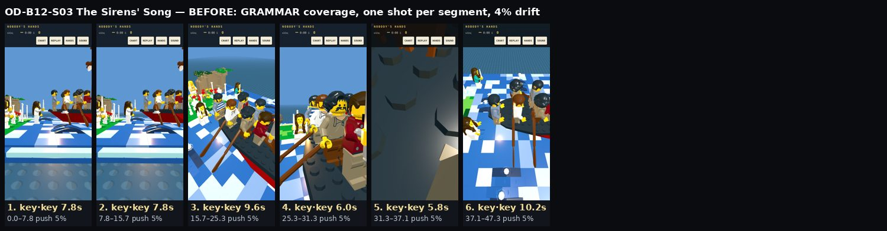 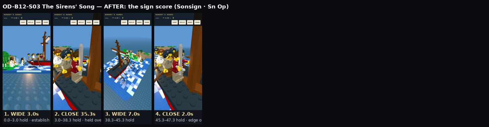

**Reads as a sonsign.** Before, there were six key shots, one per narration segment, each cut on a line. After, the fast book enters in 3 s, then one close on the bound man at the mast is held for 35 s across five narration seams. Two draws landed on the same set-up and were merged into one shot. The song carries the scene, and the bed stays open. The book's wide takes 7 s and a 2 s exit returns to him. Few cuts, the image starved, the sound leading. In the take the same direction gives WIDE 3 s (in), a close on Odysseus 11 s, the insert at the mast 9.5 s, a close 20 s and WIDE 3 s (out), with no bed duck in the sound log.

### OD-B11-S01 · The Blood Pit Opens — Sheets of the past (Sp As Bg)

Direction: `slow` (book `slow`), hold ≥ 7 s, move `track`, bias WIDE 0.54, MID 0.32, CLOSE 0.11, OBJ 0.03, empty frame, subject: odysseus.

**Before** (4 shots, mean 10.4 s)

| # | time | s | kind | move | note |
|---:|---|---:|---|---|---|
| 1 | 0.0–9.1 | 9.1 | key | push 5% |  |
| 2 | 9.1–23.4 | 14.4 | key | push 5% |  |
| 3 | 23.4–32.1 | 8.7 | key | push 5% |  |
| 4 | 32.1–41.5 | 9.4 | key | push 5% |  |

**After** (4 shots, mean 10.4 s)

| # | time | s | kind | move | note |
|---:|---|---:|---|---|---|
| 1 | 0.0–9.1 | 9.1 | EMPTY | hold | no figure |
| 2 | 9.1–23.4 | 14.4 | WIDE | track | establish |
| 3 | 23.4–32.1 | 8.7 | WIDE | track |  |
| 4 | 32.1–41.5 | 9.4 | MID (key) | hold |  |

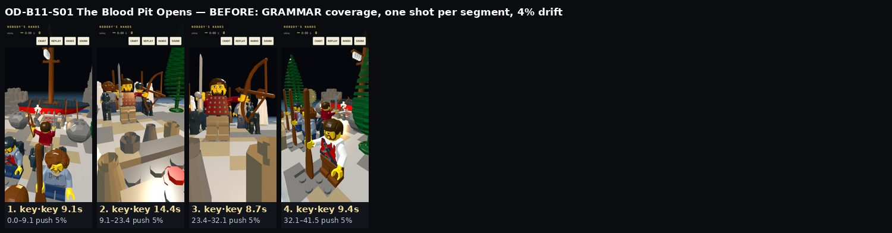 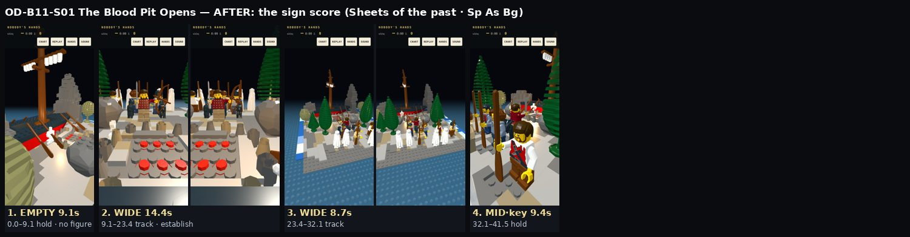

**Reads as sheets of the past.** Before, there were four key shots on figures (a dialogue scene's coverage of a scene with no dialogue). After, it opens on 9 s of the black shore with no figure, then gives two long lateral tracks (14 s and 9 s) along the ritual and the rows of shades, and ends on the gate's key. The holds are long, the mist is continuous and nothing is ranked.

### OD-B09-S10 · Escape beneath the Rams — Demark (Dm Mk Ic)

Direction: `mid` (book `fast`), hold ≥ 3 s, move `hold`, bias WIDE 0.23, MID 0.2, CLOSE 0.23, OBJ 0.34, insert: the lead ram, subject: odysseus.

**Before** (5 shots, mean 14.5 s)

| # | time | s | kind | move | note |
|---:|---|---:|---|---|---|
| 1 | 0.0–10.7 | 10.7 | WIDE | drift 1.04→0.96 |  |
| 2 | 10.7–23.2 | 12.5 | MID | drift 1.04→0.96 |  |
| 3 | 23.2–53.8 | 30.5 | WIDE | drift 1.04→0.96 |  |
| 4 | 53.8–63.7 | 9.9 | CLOSE | drift 1.04→0.96 |  |
| 5 | 63.7–72.4 | 8.8 | MID | drift 1.04→0.96 |  |

**After** (20 shots, mean 3.6 s)

| # | time | s | kind | move | note |
|---:|---|---:|---|---|---|
| 1 | 0.0–3.2 | 3.2 | WIDE | hold | establish |
| 2 | 3.2–6.7 | 3.5 | WIDE | hold | series 1/18 |
| 3 | 6.7–10.2 | 3.5 | WIDE | hold | series 2/18 |
| 4 | 10.2–13.7 | 3.5 | WIDE | hold | series 3/18 |
| 5 | 13.7–17.2 | 3.5 | WIDE | hold | series 4/18 |
| 6 | 17.2–20.7 | 3.5 | WIDE | hold | series 5/18 |
| 7 | 20.7–24.2 | 3.5 | WIDE | hold | series 6/18 |
| 8 | 24.2–27.7 | 3.5 | WIDE | hold | series 7/18 |
| 9 | 27.7–31.2 | 3.5 | WIDE | hold | series 8/18 |
| 10 | 31.2–34.8 | 3.5 | WIDE | hold | series 9/18 |
| 11 | 34.8–38.3 | 3.5 | WIDE | hold | series 10/18 |
| 12 | 38.3–41.8 | 3.5 | WIDE | hold | series 11/18 |
| 13 | 41.8–45.3 | 3.5 | WIDE | hold | series 12/18 |
| 14 | 45.3–48.8 | 3.5 | WIDE | hold | series 13/18 |
| 15 | 48.8–52.3 | 3.5 | WIDE | hold | series 14/18 |
| 16 | 52.3–55.8 | 3.5 | WIDE | hold | series 15/18 |
| 17 | 55.8–59.3 | 3.5 | WIDE | hold | series 16/18 |
| 18 | 59.3–62.8 | 3.5 | WIDE | hold | series 17/18 |
| 19 | 62.8–66.3 | 3.5 | WIDE | hold | series 18/18 |
| 20 | 66.3–72.4 | 6.1 | OBJ | hold | break (the series set-up) · creature.lead-ram |

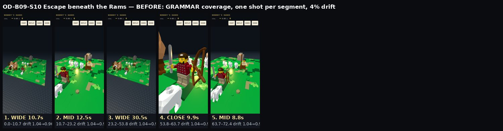 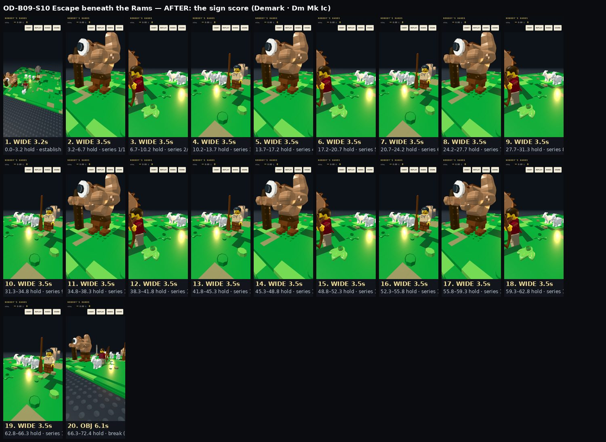

**Reads as a demark.** Before, five mixed shots (WIDE, MID, WIDE 30 s, CLOSE, MID). After, 18 matched frames follow the establishing wide: one low set-up and one length (3.5 s), cycling three positions across the cast (the giant's hands, Odysseus, the flock), so it reads as each triad passing. The last shot breaks the series: 6 s on the lead ram, with Odysseus and the giant in frame.

### OD-B23-S04 · The Bed Test — Symbol (Sb Sd Ic)

Direction: `slow` (book `slow`), hold ≥ 4 s, move `push`, bias WIDE 0.12, MID 0.12, CLOSE 0.37, OBJ 0.39, insert: the olive bed, subject: penelope.

**Before** (6 shots, mean 7.6 s)

| # | time | s | kind | move | note |
|---:|---|---:|---|---|---|
| 1 | 0.0–5.6 | 5.6 | key | push 5% |  |
| 2 | 5.6–18.8 | 13.2 | key | push 5% |  |
| 3 | 18.8–24.4 | 5.6 | key | push 5% |  |
| 4 | 24.4–30.1 | 5.7 | key | push 5% |  |
| 5 | 30.1–35.0 | 4.8 | key | push 5% |  |
| 6 | 35.0–45.5 | 10.6 | key | push 5% |  |

**After** (8 shots, mean 5.7 s)

| # | time | s | kind | move | note |
|---:|---|---:|---|---|---|
| 1 | 0.0–5.6 | 5.6 | WIDE | push | establish |
| 2 | 5.6–14.1 | 8.5 | CLOSE | push | penelope |
| 3 | 14.1–18.8 | 4.7 | WIDE | push |  |
| 4 | 18.8–24.4 | 5.6 | OBJ | push | prop.olive-tree-marriage-bed |
| 5 | 24.4–30.1 | 5.7 | WIDE | push |  |
| 6 | 30.1–35.0 | 4.8 | CLOSE | push | penelope |
| 7 | 35.0–42.0 | 7.0 | OBJ | push | prop.olive-tree-marriage-bed |
| 8 | 42.0–45.5 | 3.6 | CLOSE | push | penelope |

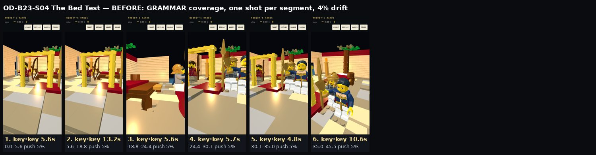 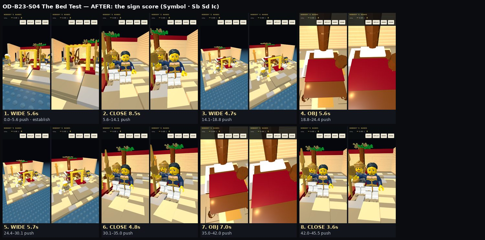

**Reads as a symbol.** The bed (the previs' `prop.olive-tree-marriage-bed`: the red bed and the olive trunk through it) gets two inserts, each pushed in. They are intercut with closes on Penelope and wides of the chamber. Every shot pushes, as the Sd push asks.

### OD-B05-S01 · Hermes Carries the Decree — Liquid perception (Lq As)

Direction: `slow` (book `slow`), hold ≥ 6 s, move `track`, bias WIDE 0.48, MID 0.34, CLOSE 0.06, OBJ 0.12, subject: hermes.

**Before** (3 shots, mean 17.8 s)

| # | time | s | kind | move | note |
|---:|---|---:|---|---|---|
| 1 | 0.0–31.1 | 31.1 | WIDE | drift 1.04→0.96 |  |
| 2 | 31.1–41.0 | 9.9 | CLOSE | drift 1.04→0.96 |  |
| 3 | 41.0–53.5 | 12.4 | MID | drift 1.04→0.96 |  |

**After** (6 shots, mean 8.9 s)

| # | time | s | kind | move | note |
|---:|---|---:|---|---|---|
| 1 | 0.0–7.0 | 7.0 | EMPTY | hold | no figure |
| 2 | 7.0–13.0 | 6.0 | WIDE | track | establish |
| 3 | 13.0–21.5 | 8.5 | MID | hold |  |
| 4 | 21.5–31.1 | 9.6 | WIDE | track |  |
| 5 | 31.1–41.0 | 9.9 | WIDE | track |  |
| 6 | 41.0–53.5 | 12.4 | MID | track |  |

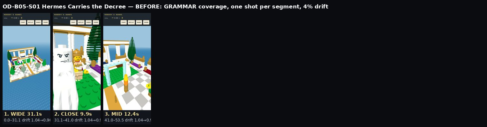 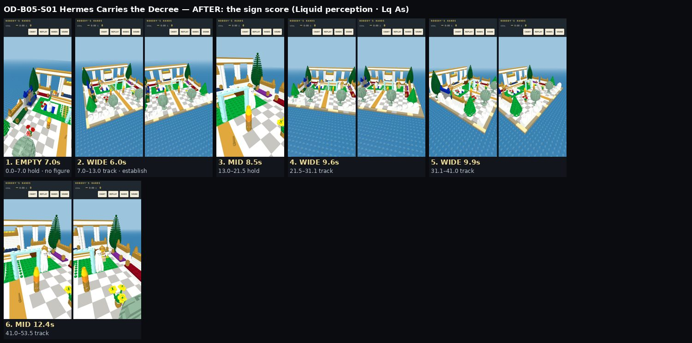

**Reads as liquid perception with an any-space-whatever.** The grove is held empty for 7 s before anyone is in frame (the As secondary: the score did not set `empty_frame` here, and the As rule adds it). Then come long tracks (6 to 12 s) over the island and the sea and a MID on Hermes. Before, there were three GRAMMAR shots of 11 to 30 s with a 4% drift.

### OD-B20-S05 · The Hall of Death — Peaks of the present (Pp Dv)

Direction: `mid` (book `fast`), hold ≥ 4 s, move `hold`, bias WIDE 0.32, MID 0.46, CLOSE 0.22, subject: theoclymenus.

**Before** (4 shots, mean 10.4 s)

| # | time | s | kind | move | note |
|---:|---|---:|---|---|---|
| 1 | 0.0–10.6 | 10.6 | WIDE | drift 1.04→0.96 |  |
| 2 | 10.6–22.5 | 11.9 | MID | drift 1.04→0.96 |  |
| 3 | 22.5–32.4 | 9.9 | CLOSE | drift 1.04→0.96 |  |
| 4 | 32.4–41.5 | 9.1 | MID | drift 1.04→0.96 |  |

**After** (8 shots, mean 5.2 s)

| # | time | s | kind | move | note |
|---:|---|---:|---|---|---|
| 1 | 0.0–4.0 | 4.0 | WIDE | hold | establish |
| 2 | 4.0–10.6 | 6.6 | MID | hold |  |
| 3 | 10.6–14.6 | 4.0 | WIDE | hold |  |
| 4 | 14.6–22.5 | 7.9 | MID | hold |  |
| 5 | 22.5–26.9 | 4.4 | CLOSE | hold | theoclymenus |
| 6 | 26.9–32.4 | 5.5 | MID | hold |  |
| 7 | 32.4–36.4 | 4.0 | MID | hold |  |
| 8 | 36.4–41.5 | 5.1 | WIDE | hold |  |

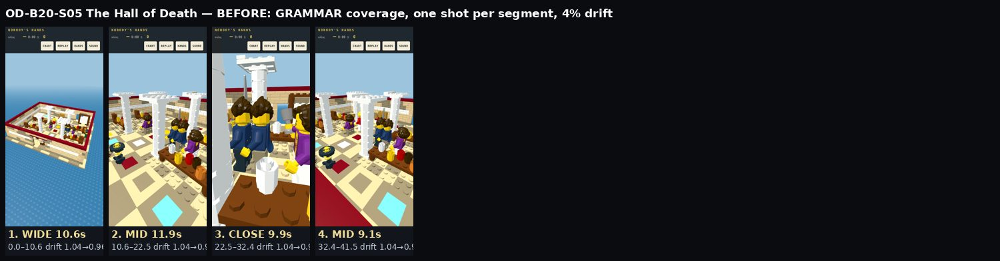 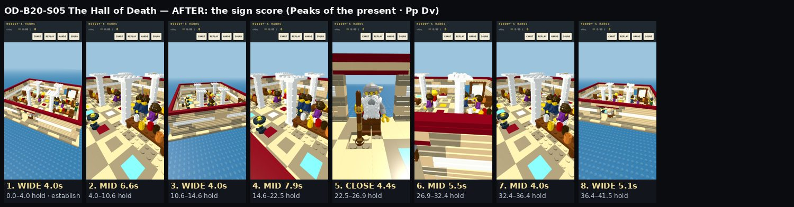

**Reads as a peak of the present, mostly.** The feast is held in wides and mids at the book's mid rhythm (4 to 8 s, static), and the one close lands on Theoclymenus as his line begins (22.5 s). Nothing is marked as a vision. The Dividual pan across the faces is not a separate shot: the direction's `move` is `hold`, so the mids on the suitors are held rather than panned.

